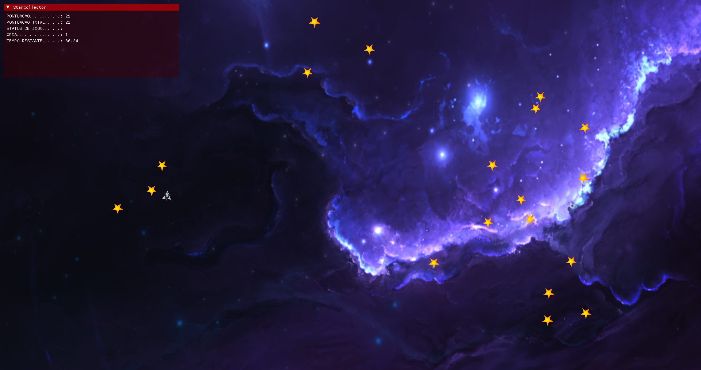

# StarCollector!
This is a star-collecting game project. Created for the purpose of consolidating knowledge, it may not follow the best technologies or market practices, but a great deal of effort was put into its logic and learning during development. See below for more information.

## About the Project
Aimed at evolving within the field of game development and graphical applications, this game was built alongside its own small Engine, serving as a foundation to study and learn new technologies. For the most part, it is a learning, structuring, and experimentation project.

## Implementations
Here I list implementations and feature additions compared to my previous projects (Graphics-Learning):
- .ini file reader;
- Keyboard and Mouse class;
- HUD addition with ImGui;
- Sound addition with Minisound;
- Generic object class addition (BOX_OBJECT_MANAGER);
- Improved matrix usage on objects;
- Better arrangement of Vertex and Fragment Shaders;
- Simple physics;
- Parallax;
- Among others.

## Technologies Used
- C++ 17
- OpenGL
- GLFW
- GLAD
- Minisound
- Dear ImGui
- GLM

## Folder Structure
- ├── src/             # Source code (.cpp and .h) for Engine and Game
- ├── shaders/         # Vertex and Fragment Shader files (.vert, .frag)
- ├── assets/          # Textures (.png) and sound effects (.mp3)
- ├── include/         # Headers for external libraries (GLFW, GLM, Glad)
- ├── lib-mingw-w64/   # Linked static binaries for compilation
- └── config/          # Game configuration .ini files

## How to Compile
1. Make sure you have MinGW-w64 installed and set up on your computer.
2. Clone the repository.
3. Run Build.bat or make from the root directory.
4. Enjoy.

# Final Note on Learning

**It was a great experience.**
I believe that, even though this is my first truly playable project, it was the one that opened my mind the most to game development. I learned about game loops, rendering, and many other things. Not to mention all the excitement, joy, and enthusiasm it brought me. I hope to have the time to continue producing and studying this vast universe of computer graphics and game development.

**It was an explosion of new things.**
Among all my projects (without considering the journey as a whole up to this point), this is the one I learned the most from. From simple parallax, simple physics, to new technologies — so many things that I couldn't possibly list them all (because learning is not about memorizing; we remember when needed). I loved the experience, and I hope to continue my studies and have fun learning and consolidating my future.
